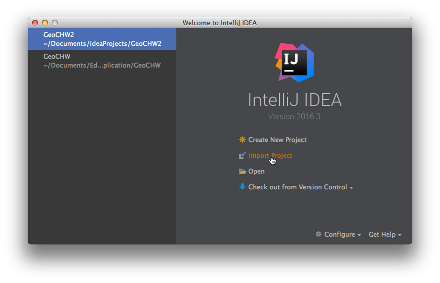

### Geo Application Control HW

## 1. Требования

    1. Для использования данного сайт пользователь должен зарегистрирован в системе
    2. Каждый пользователь может создать свой чат
    3. Каждый пользователь может добавлять собеседников либо через шаринг ссылки чата, либо через поиск друга в самой системе
    4. Каждый пользователь может добавить себе друга
    5. Для каждого чата создается отдельная страница с картой, панели с контролами и сообщениями
    6. На карте можно размещать как текстовые сообщения, так и различные геометрические примитивы, картинки и комментарии
    7. Чат должен быть интерактивным в режиме реального времени
    8. Пользователь может удалять себя из чата
    9. Пользователь может удалять из чата собеседника
    10. Пользователь может удалять сам чат
    11. Пользователь может удалить свою страницу
    12. Пользователь должен иметь возможность редактировать свои личные данные
    13. Все сообщения, комментарии чата, отметки на карте должны быть сохранены в базе данных
    14. Отметки на карте можно менять, удалять и передвигать
    15. Пользователь может искать интересующие сообщения по меткам, ключевым словам и адресам
    16. Пользователь может искать места по меткам, ключевым словам и адресам
    17. Создатель чата может настроить уровни доступа чата: публичный (для всех пользователей) и приватный (только для друзей)
    18. Пользователь может просматривать сообщения, комментарии, метки всех публичных чатов
    19. Пользователь может просматривать статистику и аналитику публичных чатов
    
## 2. Распределение задач
        
    2.1 Ирина
    
        2.2.1 Разработка интерфейса главной страницы
        2.1.2 Разработка интерфейса страницы регистрации и аутентификации
        2.1.3 Создание чата с возможностью шаринга
        2.1.4 Визуализация аналитики 
        2.1.5 Декодирования местоположения, поиск по тегам и ключевым словам
        
    2.2 Павел
        
        2.2.1 Написать логику регистрации пользователя
        2.2.2 Написать логику аутентификации пользователя
        2.2.3 Разработать личную страницу пользователя с возможностью
              редактирования личных данных
        2.2.4 Добавление собеседников в чат (по ссылке и на самом сайте)
        2.2.5 Получение аналитики с сервера
        
### 3. Подробная инструкция работы

1) Перейти в папку и в консольной строке ввести: 
git clone https://github.com/vespera128bit/geochw.git

2) Открыть Idea и импортировать проект, затем следовать инструкциям

3) Ничего не меняйте

4) Ничего не меняйте

5) Ничего не меняйте

6) Ничего не меняйте

7) Должно появиться окно с проектом. 
   На верхней панеле должны быть две кнопки со стрелками и надписью VCS, значит git распознался

8) Запустите проект

9) Сервер должен быть собран и запущен. Если появилась строчка "Started application и бла бла"
значит все OK

10) Введите в браузер localhost:8080. Если появился волшебный кот, вжух и все OK

        Ирина:
        1. Выполнить в консоле git clone https://github.com/vespera128bit/geochw
        2. В Idea открыть папку с загруженным проектом
        3. Если появится сообщение "Maven: Enable Auto-Import", нажимайте на него
        4. Попробовать запустить. Если не получится, то пишите мне. Предварительно отправьте скриншот
        5. В папке /src/main/resources открыть файл для редактирования index.html 
        6. Файл index.html служит главной страницей 
        7. В нем нужно будет выполнить задачи 2.2.1, 2.2.2
        
        Павел:
        1. Выполнить в консоле git clone https://github.com/vespera128bit/geochw
        2. В Idea открыть папку с загруженным проектом
        3. Если появится сообщение "Maven: Enable Auto-Import", нажимайте на него
        4. Попробовать запустить. Если не получится, то пишите мне. Предварительно отправьте скриншот
        5. Добавить код регистрации и аутентификации пользователя в index.html, 
        привязать логику к интерфейсу, разработанному Ириной в п. 7
        
### 4. Технологии

    Back-End:
    1. PostgreSQL
    2. Postgis
    3. Geohash
    4. Spring MVC, JDBC, WebSocket
    5. Google Protobuffers
    
    Front-End
    1. Leaflet
    2. Leaflet Draw, Drag
    3. Terraformer WKT reader
    4. JSTS
    5. Plotly
    6. CartoDB (optional)
    7. Bootstrap
    8. JQuery
    
### 5. REST API

    1. POST /user
    2. PUT /user
    3. DELETE /user
    4. POST /user/auth
    5. POST /user/{userId}/chat/new
    6. PUT /chat
    7. DELETE /chat
    8. GET /user/{userId}/chats
    9. POST /user/{userId}/chat/{chatId}
    10. SEND* /chat/{chatId}/message/new 
    11. SUBSCRIBE* /chat/{chatId}/message/broacast
    12. SEND* /chat/{chatId}/note/new
    13. SUBSCRIBE* /chat/{chatId}/note/broadcast
    
    * STOMP 
